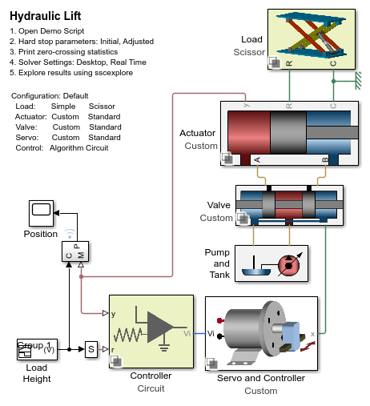

# **Hydraulic Lift Table**
Copyright 2012-2023 The MathWorks(TM), Inc.

View on File Exchange:   
You can also open in MATLAB Online: 

Models a hydraulic lift table with one electrohydraulic actuator.  
A control system, implemented as an analog circuit tracks a reference 
extension length for the actuator, which raises and lowers the table.  
The controller commands the voltage to a servomotor which moves the
spool in a hydraulic valve to adjust the flow into and out of a 
double-acting hydraulic cylinder.

Open project Hydraulic_Lift.prj to get started.

There are many variants within this model that demonstrate how to use
standard components from the Simscape add-on products and create 
custom components by combining Simscape foundation libraries.  
A demonstration script goes through additional steps in a Model-Based 
Design workflow, such as parameter sweeps and hardware-in-the-loop simulation

